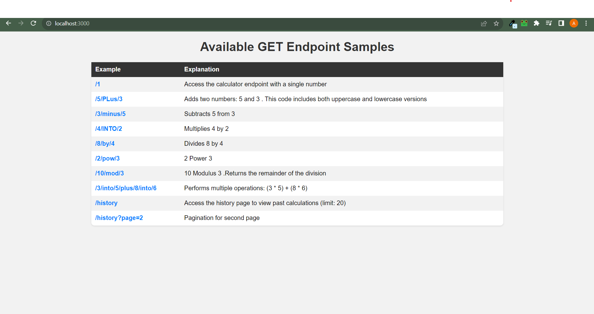
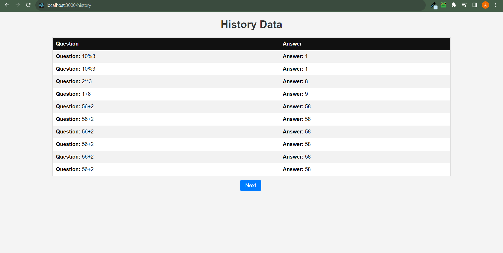

# Calculator App

This is a simple calculator application built using Express.js that allows you to perform basic arithmetic calculations by providing a concatenated input string. The application supports addition, subtraction, multiplication, division, modulo, and exponentiation operations.


## Installation

1. **Clone the repository:**

```bash
git clone https://github.com/your-username/calculator-app.git
```

2. **Navigate to the project directory:**


```bash
cd calculator-app
```

3. **Install the required dependencies:**

```bash
npm install express mongoose ejs
```

4.**Create a .env file in the project root:**
Create a file named .env in the root directory of the project. Add your MongoDB connection string to this file.

```bash
MONGODB_URI=your_mongodb_connection_string
```


5. **Start the server:**
```bash
npm start
```
   


## Features

### 1. Calculator Interface

The calculator app provides a user-friendly web interface that allows you to input complex mathematical expressions using a concatenated string. You can combine numbers, arithmetic operators, and specific keywords for operations.

### 2. Mathematical Operations

The application supports a range of mathematical operations:

- **Addition**: You can use either the keyword "plus" or the "+" symbol.
- **Subtraction**: You can use either the keyword "minus" or the "-" symbol.
- **Multiplication**: You can use either the keyword "into" or the "*" symbol.
- **Division**: You can use either the keyword "by" or the "/" symbol.
- **Modulo**: You can use either the keyword "mod" or the "%" symbol.
- **Exponentiation**: You can use either the keyword "pow" or the "**" symbol.

### 3. History Page

The app features a history page that displays the most recent calculations. The history is presented in a paginated format, allowing you to navigate through your past calculations with ease. It only allow 20 previous expression .

## Screenshots

### Calculator Interface


### History Page


## Usage

1. Enter a mathematical expression in the input field using the specified format.
2. Click the "Calculate" button to obtain the result.
3. Visit the "History" page to review your recent calculations.
